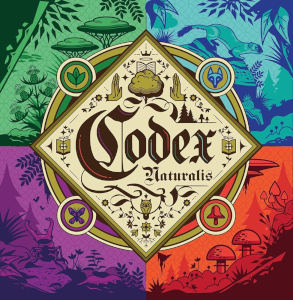

# Prova Finale Ingegneria del Software - AA 2023-2024  
### Politecnico di Milano, Group 11



## Team Members

- [Franzese Samuele](https://github.com/SamueleFranzese02)
- [Geronimi Gloria](https://github.com/gloriageronimi)
- [Guarisco Alessio](https://github.com/Aleee-ggr)
- [Ieva Daniele](https://github.com/daniele-ieva)

## Documentation

- [Generated JavaDoc](deliverables/final/javadoc/)

### UML

- [Initial UML](deliverables/initial/UML.png)
- [Final UML](deliverables/final/uml/UML.pdf)
- [Final Autogenerated Controller UML](deliverables/final/uml/controllerUML.png)

### Sequence diagrams

- [Draw a card](deliverables/final/uml/draw_card.png)
- [Place a card](deliverables/final/uml/place_card.png)
- [Player login](deliverables/final/uml/player_login.png)

### Testing

| Package    | Classes      | Methods       | Lines          |
|------------|--------------|---------------|----------------|
| Model      | 100% (24/24) | 85% (143/167) | 83% (377/452)  |
| Controller | 100% (8/8)   | 86% (100/115) | 68% (390/569)  |
| Network    | 91% (66/72)  | 91% (304/333) | 84% (977/1160) |

For further information about testing coverage, look [here](deliverables/final/TestCoverage.png).


### Tools

| Library/Plugin | Description                                                     |
|----------------|-----------------------------------------------------------------|
| __Maven__      | Build automation tool used primarily for Java projects.         |
| __JUnit__      | Unit testing framework for the Java programming language.       |
| __JavaFX__     | Software platform for creating and delivering GUI applications. |

## Functionalities 

### Game Specific:  
- Full Rule-set

### Game Agnostic:  
- Server and Client implemented in JavaRMI and Socket
- TUI without external libraries
- GUI in JavaFX
  
### Advanced Features:

| Function                 | Implemented        |
|--------------------------|--------------------|
| Multiple games           | :white_check_mark: |
| Disconnection resilience | :white_check_mark: |
| Chat                     | :white_check_mark: |
| Persistence              | :x:                |

## Compile and Execute

The group worked with a Unix-first mindset, the game is fully reliable on Linux and MacOS but for Windows it may not work as expected.
### Requirements:
To work correctly the project needs:  
- `Java 21` or above  
- `mvn` and `shade` for compiling
- the `trattatello` font
  
### Windows pre-setup:
To run on Windows you should use the new [windows terminal](https://github.com/microsoft/terminal), default terminal from windows 11.  
to run the TUI you should:
- enable UNICODE characters in the terminal
- use a font that support UTF-8
- adjust the font size depending on your screen

The safest way to enable UTF-8 on your windows terminal is to enable `Use Unicode UTF-8 for worldwide language support` in your OS language settings.  
on some systems typing on the terminal before running the game:
```
chcp 65001
```
should also work.  
Because those steps may vary depending on your configurations the safe bet is always using WSL with Ubuntu or a UNIX-based system.

### MacOS Apple Silicon pre-setup:
If you are running a MacBook with Apple Silicon you should use a supported version of javaFX.  
we recomend [azul](https://www.azul.com/downloads/?version=java-22&os=macos&architecture=arm-64-bit&package=jdk-fx#zulu) sdk version 22

### Every OS:
To compile the project move into the root project folder use the command:
```
mvn package shade:shade
```
then you should be able to run the package PSP11.  
if you want to run the server you should run:
```
java -jar target/PSP11-1.0.jar server
```
for the client:
```
java -jar target/PSP11-1.0.jar client
```

### Precompiled Jars
We recommend that you compile the game yourself as shown above.  
Depending on your CPU architecture and OS the following packages may not work for you. 
- [Linux x86 jar](deliverables/final/jar/PSP11-1.0-Linux.jar)
- [MacOS arm jar](deliverables/final/jar/PSP11-1.0-Mac.jar)
